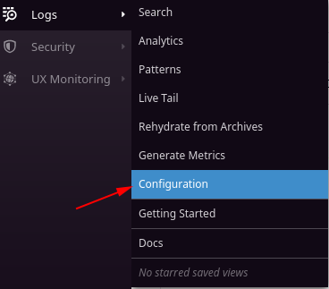
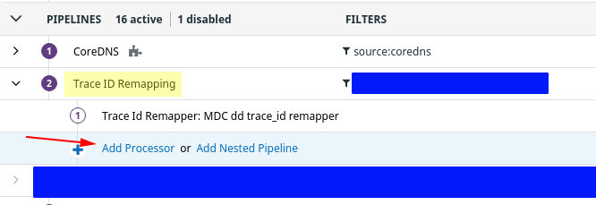
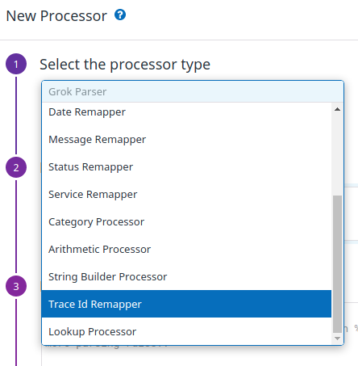
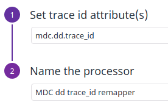

# quarkiverse-datadog-opentracing-setup-example

This repository demonstrate how to use the Quarkus Datadog Opentracing extension

It exposes a simple REST resource and service to demonstrate the following features:
- smallrye-opentracing
- datadog-opentracing
- logging-json

The following features are also use to ease that example
- resteasy
- yaml config
- smallrye openapi / swagger ui

If you're new to Datadog, i suggest you to read all sections in this readme. 
You'll get a few tips to setup your local Datadog agent and Datadog account to see this extension results.

## Native docker image

* Build the application 

```
mvn package -Pnative
```

* Build the docker image

```
docker build -f src/main/docker/Dockerfile.native -t quarkus-datadog-opentracing-example .
```

* Run the docker image

```
docker run -i --rm --name quarkus-datadog-opentracing-example \
	--network web \ 					# Keep same share network as the Datadog agent
	-e XMX_SETUP='-Xmx64m' \
	-p 8080:8080 \
	quarkus-datadog-opentracing-example:latest
```

## Running a local Datadog Agent

For local deployment / runs, to have your traces and logs shipped to your Datadog account, you will need to start a Datadog agent.

Here is the docker command and configuration to do so.

```
docker run -d --name dd-agent \
	--network web \					# Use a shared network between your docker containers
	-v /var/run/docker.sock:/var/run/docker.sock:ro \
	-v /proc/:/host/proc/:ro \
	-v /sys/fs/cgroup/:/host/sys/fs/cgroup:ro \
	-p 8126:8126/tcp \					# Defaults
	-p 8125:8125/udp \					# Defaults
	-e DD_API_KEY=xxxxxxx \				# Replace with your Datadog API Key
	-e DD_SITE="datadoghq.eu"  \			# Optional: only if you have an European account
	-e DD_LOGS_ENABLED=true  \				# To forward logs
	-e DD_LOGS_CONFIG_CONTAINER_COLLECT_ALL=true  \	# To forward logs           
	-e DD_DOGSTATSD_NON_LOCAL_TRAFFIC=true \
	-e DD_APM_ENABLED=true \
	-e DD_HOSTNAME=MyLocalComputer \			# Replace the value by your machine name
	-e DD_ENV=Local \					# Replace the value by your environment name
	-e NON_LOCAL_TRAFFIC=false \
	gcr.io/datadoghq/agent:latest
  
```


## Set up your Datadog account

### TraceId Remapper on Datadog

This extension will log the trace_id and span_id into the MDC, under 'mdc.dd.trace_id' and 'mdc.dd.span_id'.
You have to configure your one of your log pipeline with a Trace Id Remapper processor to have the correlation between trace and logs on Datadog UI and Dashboards.

If you are not familiar with Datadog remapping and processor concept, i suggest you to read [the official documentation](https://docs.datadoghq.com/logs/processing/processors/?tab=ui#trace-remapper)

**Procedure**

On your Datadog account:

* Open your logs configuration tab and create a new pipeline or edit an existing one.



* Add a new Processor to this pipeline



* On the New Processor screen, select 'Trace Id Remapper' as processor type



* Input the location of the trace_id information on your logs. This should be under 'dd.trace_id' or 'mdc.dd.trace_id' depending whether you use the json logger extension for Quarkus or not. In the example, replace 'dd.trace_id' by the label you configured in your application logger.



**Done!**

Now start your Datadog local agent and your application and generate activity with traces and logs.

Go on your Datadog account, on the APM after a few seconds or minutes you should see your traces, and the related logs for each traces on the Logs tab.


